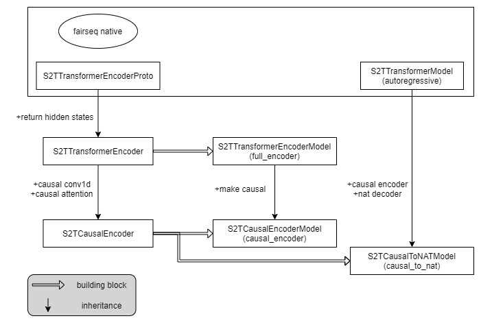

# More Information
## Hyperparameters and Config Files
Hyperparameters are structured like the code they are associated with. They are handled by fairseq and Hydra.
```python
config/
├── criterion/
│   ├── # config files for loss computation related hyperparameters.
│   └── ...
├── model/
│   ├── # config files for model related hyperparameters.
│   └── ...
├── task/
│   ├── # config files for training objectives (asr/st/mt) related hyperparameters.
│   └── ...
├── distill.yaml # config file for mt distillation. Same as below.
└── general.yaml # config file for other general hyperparameters.
```

**Using Configs**

We use `exp/1-autoregressive_asr.sh` as an example.
```bash
#!/usr/bin/env bash
TASK=ar_asr           # name to identify experiment on tensorboad and in checkpoints directory.
. ./data_path.sh      # setup the "DATA","SRC","TGT" and "lang" variables. do modify it if your language or path to data is different.

### asr
metric=wer
maximize=false

CONF=$DATA/config_${lang}.yaml    # this is the data manifest. code to parse it is in task/speech_to_text_multi_task_dataset.py

export CUDA_VISIBLE_DEVICES=0
FP16=true # half precision training

python -m fairseq_cli.hydra_train \
    model=autoregressive \        # use config/model/autoregressive.yaml for model
    task=asr_only \               # use config/task/asr_only.yaml for task
    criterion=ls_cross_entropy \  # use config/criterion/ls_cross_entropy.yaml for criterion
    task.data=$DATA \
    task.config_yaml=$CONF \
    common.fp16=$FP16 \
    common.user_dir=.. \          # tell fairseq to include our extension code
    common.tensorboard_logdir=logdir/$TASK \
    dataset.train_subset=train_${lang} \
    dataset.valid_subset=dev_${lang} \
    checkpoint.save_dir=checkpoints/$TASK \
    checkpoint.best_checkpoint_metric=$metric \
    checkpoint.maximize_best_checkpoint_metric=$maximize \
    --config-dir ../config/ \
    --config-name general         # use config/general.yaml for generic configs
```
The rest of the training scripts under `exp/` are similarly written.

## Model relationships
There are many models declared in `models/`. The relationship between them is summarized as below.

